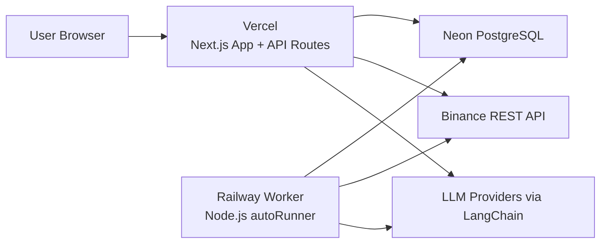

# FinAI

[](https://github.com/CoderZHH/FINAI/stargazers)
[](https://nextjs.org/)
[](https://neon.tech/)
[](https://railway.app/)
[](https://vercel.com/)

FinAI is a multi-model AI trading and research platform focused on the full loop of:

`real-time market watching -> model decision -> simulated execution -> equity visualization`

The project supports model configuration, prompt template management, user login/register, guest read-only access, BTC benchmark comparison, trade records, and account equity charts.

## Project Overview

This repository contains the full project used for local development and deployment:

- `finai-zhh/`: main web application
- `binance-spot-api-docs-master/`: Binance API reference materials used during development

The production architecture is split into three layers:

- `Vercel`: web frontend and API routes
- `Railway`: long-running Node.js worker
- `Neon PostgreSQL`: persistent data storage

## Preview

- Live site: [https://finai-zhh.vercel.app](https://finai-zhh.vercel.app)
- Web layer: `Vercel`
- Worker layer: `Railway`
- Database: `Neon PostgreSQL`

Typical product views:

- landing page
- login / register
- dashboard with equity curve and BTC benchmark
- model management
- prompt template management
- logs / decisions / trades

## Architecture



Execution flow:

1. The user configures a model and prompt template in the web app.
2. The Railway worker syncs market data, updates benchmark valuation, and triggers eligible auto-run models.
3. The decision engine builds prompts, calls LLM providers, parses structured output, and either executes or submits the decision for review.
4. Runtime account state, trades, logs, and equity time series are persisted to PostgreSQL.
5. The frontend polls API routes and renders the dashboard, cards, benchmark comparison, and logs.

## Key Highlights

- Quickly configure models and prompt templates to build an Agent workflow for real-time monitoring, model decision-making, simulated execution, and equity visualization.
- Use a standalone Node.js Worker for long-running background scheduling, driven by `setInterval`, PostgreSQL advisory locks, REST API market sync, and SSE log streaming.
- Build a multi-user dashboard with Next.js, including login/register, guest read-only mode, benchmark comparison, model management, prompt management, and trade/equity views.
- Persist runtime state, trades, benchmark data, and time-series data in PostgreSQL/Neon to keep backend execution and frontend visualization consistent.
- Solve practical deployment issues across Vercel, Railway, and Neon, including environment management, background job isolation, user data isolation, and third-party API access constraints.

## Tech Stack

### Frontend

- Next.js 16
- React 19
- SWR
- ECharts

### Backend / Runtime

- Next.js Route Handlers
- Node.js Worker
- LangChain
- Zod
- SSE

### Data / Infrastructure

- PostgreSQL
- Neon
- `pg`
- Railway
- Vercel

### External Integrations

- Binance REST API
- OpenAI-compatible / DeepSeek / Anthropic / Gemini / xAI model providers through LangChain adapters

## Core Capabilities

- User registration, login, session management, and guest read-only viewing
- Model CRUD with configurable provider, base URL, API key, tradable symbols, icon, auto-run interval, and review mode
- Prompt template management with per-user ownership and default template support
- BTC benchmark initialization and mark-to-market valuation
- Real-time-ish dashboard updates through polling and background writes
- Simulated trade execution with margin, leverage, fee, and equity accounting
- Trade records, model logs, pending decision review, and account time-series visualization
- Binance risk tier and funding rate synchronization

## How It Works

### Web Layer

The frontend reads data from the app's API routes and renders:

- account equity curves
- benchmark comparison
- trade records
- model cards
- logs and review views

### Worker Layer

The Railway worker is responsible for background tasks such as:

- loading tracked symbols
- syncing latest market prices
- importing historical market data
- updating BTC benchmark valuation
- mark-to-market for all models
- periodically syncing risk tiers and funding rates
- triggering auto-run decision cycles for eligible models

### Data Layer

PostgreSQL stores:

- users and sessions
- prompt templates
- model configuration
- runtime account snapshots
- trades
- market snapshots and history
- account equity time series
- logs and pending review decisions

## Local Development

### 1. Enter the app directory

```bash
cd finai-zhh
```

### 2. Install dependencies

```bash
npm install
```

### 3. Configure environment variables

Create `finai-zhh/.env.local` and configure at least:

```env
POSTGRES_URL=postgresql://...
POSTGRES_SSL=true

BINANCE_API_BASE=https://api.binance.com
BINANCE_FAPI_BASE=https://fapi.binance.com

NEXT_PUBLIC_BASE_URL=http://localhost:3000
INTERNAL_API_BASE_URL=http://localhost:3000

AUTO_RUNNER_TICK_MS=5000
MARKET_LOOP_INTERVAL_MS=5000
AUTO_RUNNER_DISABLED=false
```

If you need model execution or risk sync:

```env
BINANCE_API_KEY=...
BINANCE_API_SECRET=...
```

Model provider keys are configured through the UI per model.

### 4. Start the app

```bash
npm run dev
```

Important:

- `npm run dev` runs `scripts/reset-db.js` first.
- This resets the connected database and recreates the schema.
- Do not point `.env.local` to a production database unless you explicitly want to reset it.

### 5. Start the worker

In a second terminal:

```bash
cd finai-zhh
npm run worker
```

## Production Deployment

Recommended deployment split:

- `Vercel`: frontend + API routes
- `Railway`: worker process
- `Neon`: PostgreSQL database

Deployment-related notes from this project:

- Vercel is suitable for web/API requests, not for long-running background loops.
- The worker must run as a dedicated process on Railway.
- Vercel and Railway may have different outbound network behavior when calling third-party APIs.
- Environment variables must be configured consistently across both platforms.

## Repository Structure

```text
FINAI/
├── finai-zhh/
│   ├── app/
│   ├── components/
│   ├── lib/
│   ├── scripts/
│   ├── prompts/
│   └── public/
├── binance-spot-api-docs-master/
└── README.md
```

## Screenshots

This repository currently does not include sanitized product screenshots yet.

If you want to add them later, place images under:

```text
finai-zhh/docs/screenshots/
```

Recommended screenshots for the GitHub homepage:

- `landing-page.png`
- `dashboard.png`
- `model-management.png`
- `prompt-templates.png`
- `trade-review.png`

Suggested layout after screenshots are added:

```md


```

## Notes

- This project is currently a simulated trading system, not a live trading system.
- The worker and dashboard are tightly coupled through PostgreSQL state updates.
- Guest mode maps to the root account in read-only mode.

## Star This Project

If this project is useful to you, consider starring the repository:

[https://github.com/CoderZHH/FINAI](https://github.com/CoderZHH/FINAI)
