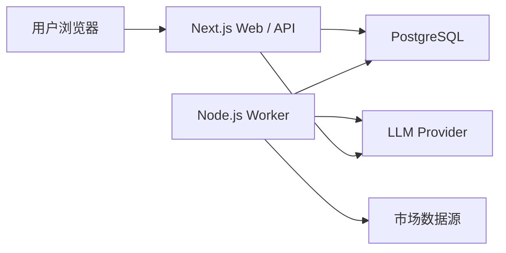
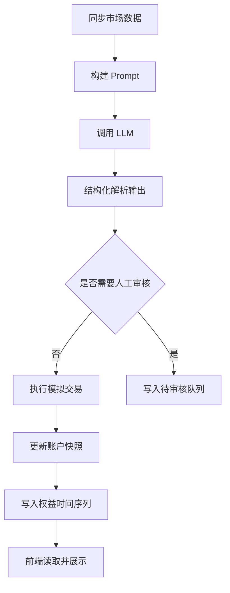

# FinAI

[](https://github.com/CoderZHH/FINAI/stargazers)
[](https://nextjs.org/)
[](https://react.dev/)
[](https://www.postgresql.org/)
[](https://www.langchain.com/)
[](#)

FinAI 是一个面向多模型实验的 AI 模拟交易平台，围绕以下闭环构建：

`市场数据同步 -> 模型决策 -> 模拟执行 -> 账户核算 -> 权益可视化`

它不是一个单纯“生成观点”的页面，而是一套完整的、可运行的交易实验系统。项目支持多用户、模型管理、提示词管理、结构化决策输出、人工审核、自动执行、账户时间序列追踪与基准线对比。

## 项目截图

### 首页


### 首页动效版


### 大盘


### 模型管理


### 模型配置


### 提示词管理


### 提示词配置


### 添加选币


## 核心能力

- 多模型管理：支持为不同模型配置 provider、模型名称、Base URL、API Key、交易标的、自动运行频率与审核模式。
- 提示词模板管理：支持用户维护系统提示词模板，并在模型运行时动态绑定。
- 结构化决策输出：通过 `LangChain + Zod` 约束模型输出 JSON，避免自由文本难以执行的问题。
- 自动执行与人工审核双路径：支持直接执行，或写入待审核队列后由用户确认。
- 模拟交易账户：支持仓位、手续费、保证金、权益、时间序列等完整账户状态更新。
- BTC Benchmark：支持基准账户独立估值，并与模型收益曲线对比。
- 多用户隔离：通过 `owner_user_id` 做模型与模板归属隔离，并支持 guest 只读模式。
- 实时展示：前端通过 `SWR` 和 `SSE` 组合读取图表、日志和运行状态。

## 系统架构



### 分层说明

#### 1. Web 层

负责：

- 页面渲染
- API Route
- 登录注册
- 模型管理
- 提示词管理
- 图表、日志、交易记录展示

技术：

- Next.js App Router
- React 19
- SWR
- ECharts

#### 2. Worker 层

负责：

- 市场数据同步
- 历史 K 线导入
- 账户重估值
- 自动调度模型
- 调用 LLM
- 执行模拟交易

技术：

- Node.js 常驻进程
- `setInterval`
- PostgreSQL advisory lock

#### 3. 数据层

负责持久化：

- 用户与 Session
- 模型配置
- 提示词模板
- 市场快照与历史行情
- 交易记录
- 账户快照
- 权益时间序列
- 日志与待审核决策

## 决策执行链路



## 关键设计点

### 1. 模型输出约束不是只靠 Prompt

项目使用了四层控制：

- Prompt 约束
- Zod Schema
- LangChain Structured Output Parser
- 决策后处理与字段归一化

这样可以确保模型输出能够进入后续执行链路，而不是停留在“自然语言建议”。

### 2. 决策执行不是单写一条交易记录

执行 `applyDecisionSet()` 时，会一并处理：

- 当前价格读取
- 合法性校验
- 持仓开平
- 保证金占用
- 手续费
- 账户余额
- 权益重算
- 时间序列追加

### 3. 前端不是实时直连交易所

浏览器只请求同源 `/api/...`，由服务端访问外部接口。这样做有两个直接收益：

- 避免前端跨域复杂度
- 不在前端暴露敏感密钥

### 4. Worker 与 Web 解耦

长驻任务不放在页面请求链路中，而是通过独立 Worker 运行，避免 Web 服务承担不必要的后台调度职责。

## 技术栈

### 前端

- Next.js 16
- React 19
- SWR
- ECharts
- Tailwind CSS

### 后端 / 运行时

- Next.js Route Handlers
- Node.js Worker
- LangChain
- Zod
- SSE

### 数据 / 基础设施

- PostgreSQL
- `pg`
- PM2
- Nginx
- Vercel / Railway / ECS（根据部署方式切换）

### 外部能力

- Binance 公共市场数据接口
- OpenAI Compatible Provider
- Anthropic
- Gemini
- xAI
- DeepSeek

## 目录结构

```text
FINAI/
├── finai-zhh/
│   ├── app/                     # Next.js 页面与 API
│   ├── components/              # 前端组件
│   ├── lib/                     # 核心业务逻辑
│   ├── prompts/                 # 提示词模板
│   ├── public/                  # 静态资源
│   ├── scripts/                 # 数据库与 worker 启动脚本
│   └── docs/PICTURE/            # README 截图资源
├── binance-spot-api-docs-master/
└── README.md
```

## 本地开发

### 1. 进入应用目录

```bash
cd finai-zhh
```

### 2. 安装依赖

```bash
npm install
```

### 3. 配置环境变量

创建 `finai-zhh/.env.local`，至少包含：

```env
POSTGRES_URL=postgresql://...
POSTGRES_SSL=true

BINANCE_API_BASE=https://data-api.binance.vision
BINANCE_FAPI_BASE=https://fapi.binance.com

NEXT_PUBLIC_BASE_URL=http://localhost:3000
INTERNAL_API_BASE_URL=http://localhost:3000

AUTO_RUNNER_TICK_MS=5000
MARKET_LOOP_INTERVAL_MS=5000
AUTO_RUNNER_DISABLED=false
```

如果需要同步带鉴权的接口：

```env
BINANCE_API_KEY=...
BINANCE_API_SECRET=...
```

### 4. 启动 Web

```bash
npm run dev
```

注意：

- `npm run dev` 会先执行 `scripts/reset-db.js`
- 它会重建当前连接的数据库结构
- 不要把 `.env.local` 指向生产数据库

### 5. 启动 Worker

```bash
npm run worker
```

## 生产部署

### 推荐拆分部署

- Web：Vercel 或单机 ECS
- Worker：Railway 或单机 ECS
- 数据库：Neon / PostgreSQL / RDS PostgreSQL

### 单机部署形态

项目已经验证过以下单机形态：

- Ubuntu
- Nginx
- PM2
- PostgreSQL

这种模式下：

- `finai-web` 作为 Next.js 生产服务运行
- `finai-worker` 作为 PM2 常驻进程运行
- Nginx 反向代理到本地 3000 端口
- PostgreSQL 可本机部署，也可后续迁移到云数据库

## README 截图怎么加

如果你后续还要继续往 README 里补截图，建议统一放到：

- [finai-zhh/docs/PICTURE](/Users/zhh/GitHub/FINAI/finai-zhh/docs/PICTURE)

然后在 `README.md` 中这样写：

```md

```

例如：

```md

```

如果你想加一个新的分组，建议按这种格式：

```md
## 页面截图

### 大盘


### 模型管理

```

## 当前状态

这个仓库已经具备完整演示能力：

- 首页
- 登录注册
- Guest 只读
- 大盘与基准线
- 模型管理
- 提示词管理
- 决策执行链路
- 日志与时间序列展示

后续如果继续扩展，建议优先做：

1. 数据源抽象层进一步解耦
2. 更细粒度的风险参数与费用配置
3. 更完善的回测 / 评估能力
4. 更正式的 CI / 部署流水线
