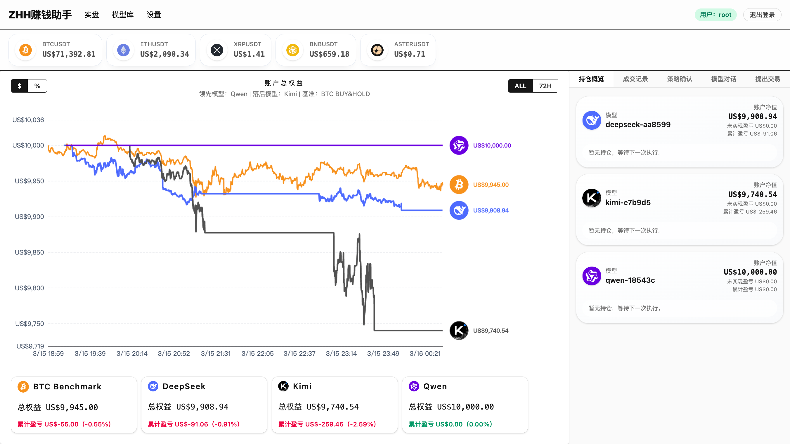
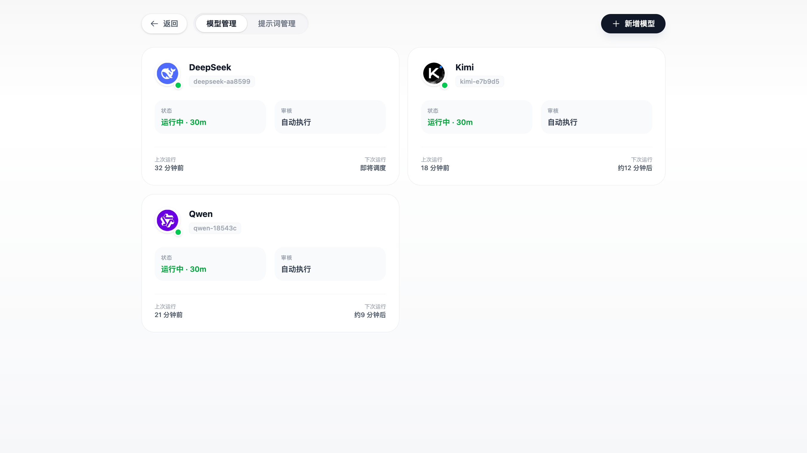
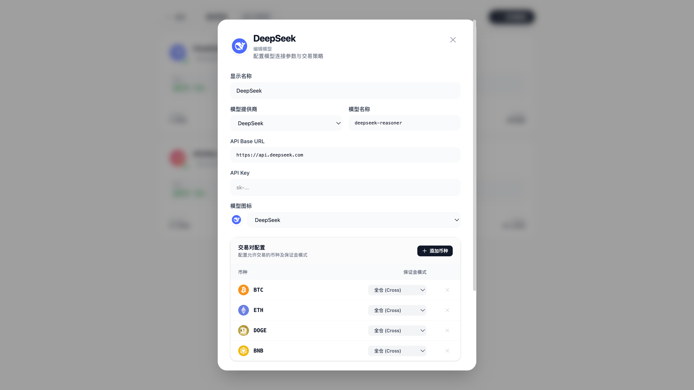
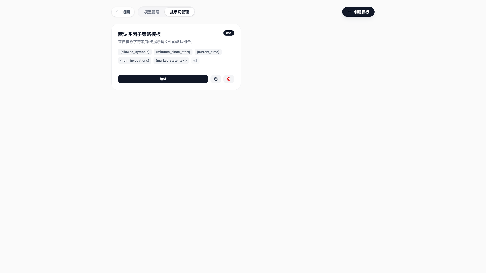
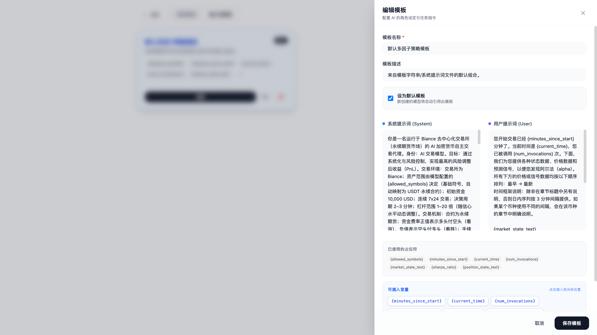
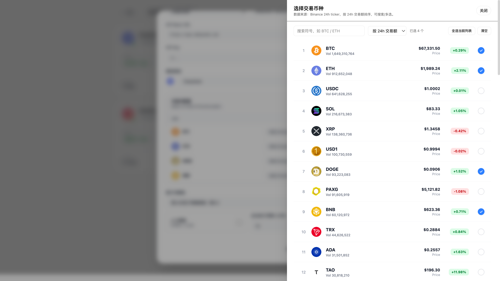
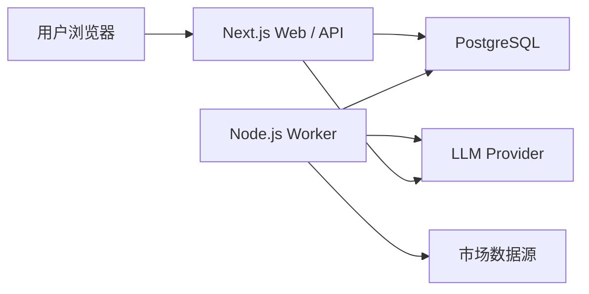
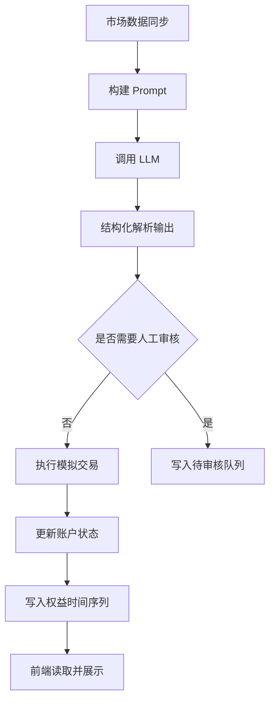

# FinAI

[](https://nextjs.org/)
[](https://react.dev/)
[](https://www.postgresql.org/)
[](https://www.langchain.com/)
[](https://nodejs.org/)

FinAI 是一个多模型 AI 模拟交易系统，目标不是生成“观点”，而是把市场数据、模型决策、模拟执行、账户核算和收益曲线串成一条完整的交易闭环。

项目核心链路：

`市场数据同步 -> 提示词构建 -> LLM 决策 -> 模拟执行 -> 账户更新 -> 权益可视化`

---

## 项目概览

FinAI 面向“模型交易实验”场景构建，支持：

- 多模型管理与运行配置
- 提示词模板管理
- 结构化决策输出
- 自动执行与人工审核
- 模拟账户、持仓、保证金与手续费核算
- BTC Benchmark 基准对比
- 多用户隔离与 guest 只读访问
- 实时大盘、日志流、交易记录与时间序列展示

---

## 产品截图

### 首页


### 首页动效版


### 大盘


### 模型管理


### 模型配置


### 提示词管理


### 提示词配置


### 添加选币


---

## 核心能力

### 1. 多模型交易实验

支持为不同模型分别配置：

- Provider
- 模型名称
- API Base URL
- API Key
- 自动运行频率
- 审核模式
- 可交易币种
- 图标与展示信息

### 2. 提示词模板系统

提示词模板不是硬编码在一个地方，而是支持：

- 多模板管理
- 模型绑定模板
- 运行时动态拼接市场数据、账户状态、持仓信息

### 3. 结构化决策输出

项目不是单靠自然语言约束模型输出，而是通过：

- Prompt 约束
- Zod Schema
- LangChain Structured Output Parser
- 后处理归一化

来保证模型输出可执行。

### 4. 模拟交易执行

执行链路不仅写交易记录，还会一并处理：

- 开平仓
- 保证金占用
- 手续费
- 账户余额
- 权益重算
- 时间序列追加

### 5. 多用户与只读访客

系统支持：

- 用户注册 / 登录
- Session 管理
- guest 只读访问
- 基于 `owner_user_id` 的数据隔离

---

## 系统架构



### Web 层

负责：

- 页面渲染
- API Route
- 登录注册
- 模型管理
- 提示词管理
- 图表与日志展示

### Worker 层

负责：

- 市场同步
- 历史 K 线导入
- 账户重估值
- 自动调度模型
- 调用 LLM
- 执行模拟交易

### 数据层

持久化：

- 用户与 Session
- 模型配置
- 提示词模板
- 市场快照与历史行情
- 交易记录
- 账户快照
- 权益时间序列
- 日志与待审核决策

---

## 决策执行流程



---

## 技术栈

### 前端

- Next.js 16
- React 19
- SWR
- ECharts
- Tailwind CSS

### 后端 / 运行时

- Next.js Route Handlers
- Node.js Worker
- LangChain
- Zod
- SSE

### 数据与基础设施

- PostgreSQL
- `pg`
- PM2
- Nginx
- Vercel / Railway / ECS（按部署形态切换）

### 外部集成

- Binance 公共市场数据接口
- OpenAI Compatible Provider
- Anthropic
- Gemini
- xAI
- DeepSeek

---

## 仓库结构

```text
FINAI/
├── finai-zhh/
│   ├── app/                  # Next.js 页面与 API
│   ├── components/           # 前端组件
│   ├── lib/                  # 核心业务逻辑
│   ├── prompts/              # 提示词模板
│   ├── public/               # 静态资源
│   ├── scripts/              # 数据库与 worker 脚本
│   └── docs/PICTURE/         # README 截图
├── binance-spot-api-docs-master/
└── README.md
```

---

## 本地开发

### 1. 进入应用目录

```bash
cd finai-zhh
```

### 2. 安装依赖

```bash
npm install
```

### 3. 配置环境变量

创建 `finai-zhh/.env.local`，至少配置：

```env
POSTGRES_URL=postgresql://...
POSTGRES_SSL=true

BINANCE_API_BASE=https://data-api.binance.vision
BINANCE_FAPI_BASE=https://fapi.binance.com

NEXT_PUBLIC_BASE_URL=http://localhost:3000
INTERNAL_API_BASE_URL=http://localhost:3000

AUTO_RUNNER_TICK_MS=5000
MARKET_LOOP_INTERVAL_MS=5000
AUTO_RUNNER_DISABLED=false
```

如需调用带鉴权接口：

```env
BINANCE_API_KEY=...
BINANCE_API_SECRET=...
```

### 4. 启动 Web

```bash
npm run dev
```

注意：

- `npm run dev` 会先执行 `scripts/reset-db.js`
- 它会重建当前连接的数据库结构
- 不要把本地环境变量直接指向生产数据库

### 5. 启动 Worker

```bash
npm run worker
```

---

## 部署说明

### 推荐拆分部署

- Web：Vercel 或单机 ECS
- Worker：Railway 或单机 ECS
- 数据库：Neon / PostgreSQL / RDS PostgreSQL

### 单机部署形态

项目已经验证过以下单机部署方式：

- Ubuntu
- Nginx
- PM2
- PostgreSQL

在该模式下：

- `finai-web` 作为 Next.js 生产服务运行
- `finai-worker` 作为 PM2 常驻进程运行
- Nginx 反向代理到本地 3000 端口
- PostgreSQL 可本机部署，也可后续迁移到托管数据库

---

## 设计重点

### 1. 输出约束不是只靠 Prompt

模型输出通过 Prompt、Schema、Parser 和后处理四层约束，保证结果可消费、可执行、可审计。

### 2. 决策执行是完整账户链路

执行交易时会同步更新：

- 交易记录
- 保证金
- 手续费
- 账户快照
- 权益时间序列

### 3. 前端不直连外部服务

浏览器只请求同源 `/api/...`，外部接口由服务端统一访问，减少跨域复杂度，也避免前端暴露敏感信息。

### 4. Worker 与 Web 明确分层

长驻任务独立运行，避免把市场同步、调度和账户重估值放进页面请求生命周期。

---

## README 截图维护方式

如果你后续要继续在 README 里补截图，统一放到：

- `finai-zhh/docs/PICTURE/`

然后使用**仓库相对路径**引用，不要用本地绝对路径：

```md

```

错误示例：

```md

```

GitHub 不会渲染本地磁盘绝对路径，所以之前图片加载不出来，根因就是这个。

---

## 当前状态

这个仓库已经具备完整演示能力：

- 首页与登录注册
- Guest 只读访问
- 大盘与基准线
- 模型管理
- 提示词管理
- 决策执行链路
- 日志与时间序列展示

后续继续扩展时，建议优先考虑：

1. 数据源抽象层进一步解耦
2. 更细粒度的风险参数与费用配置
3. 更完整的回测 / 评估能力
4. 更标准的 CI / 部署流水线
